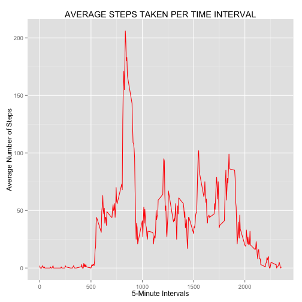

---

## title: "Reproducible Research: Peer Assessment 1"

#  A New Document

### Loading and preprocessing the data
	### removing NAs 
	### coerce dates to date class; extract weekday from date object


```r
library(ggplot2)
peer1 <- read.csv("activity.csv")
peer1 <- na.omit(peer1)
peer1$date <- as.Date(peer1$date)
peer1$date <- weekdays(peer1$date)

echo=TRUE
```

### HISTOGRAM & REPORING OF STEP TOTALS & MEAN PER DAY
### Calculation and Reporting of the Mean & Median total number of steps taken per day.


```r
peer1$date <- as.factor(peer1$date)
Sumsteps <- aggregate(peer1$steps, list(peer1$date), sum)
colnames(Sumsteps) <- c("Day", "TotalSteps")
histo <- ggplot(Sumsteps, aes(x=Sumsteps$Day, y=Sumsteps$TotalSteps)) + geom_histogram(stat="identity", binwidth = 0.5, color="black", fill="yellow") +  ylim(0, 100000) + xlab("Weekday") + ylab("Number of Steps") + labs(title="TOTAL STEPS TAKEN PER DAY")
histo
```

 

```r
Sumsteps
```

```
##         Day TotalSteps
## 1    Friday      86518
## 2    Monday      69824
## 3  Saturday      87748
## 4    Sunday      85944
## 5  Thursday      65702
## 6   Tuesday      80546
## 7 Wednesday      94326
```

```r
echo=TRUE
```


```r
peer1$date <- as.factor(peer1$date)
mediansteps <- aggregate(peer1$steps, list(peer1$date), median)
colnames(mediansteps) <- c("Day", "MedianSteps")

mediansteps
```

```
##         Day MedianSteps
## 1    Friday           0
## 2    Monday           0
## 3  Saturday           0
## 4    Sunday           0
## 5  Thursday           0
## 6   Tuesday           0
## 7 Wednesday           0
```

```r
echo=TRUE
```

###  TIME SERIES PLOT OF AVERAGE STEPS PER 5 MINUTE TIME INTERVAL
- average daily activity pattern
- mean by interval aggregated
- overall max & mean step calculated


```r
peer1$interval <- as.factor(peer1$interval)
MeanInt <- aggregate(peer1$steps, list(peer1$interval), mean)
colnames(MeanInt) <- c("Interval", "MeanbyInterval")

x <- factor(MeanInt$Interval)
x <- as.numeric(levels(x)[x])
y <- round(MeanInt$MeanbyInterval)
g <- ggplot(MeanInt, aes(x, y)) + geom_line(colour="red") + xlab("Time Intervals") + ylab("Average Number of Steps")+ xlab("5-Minute Intervals") + labs(title="AVERAGE STEPS TAKEN PER TIME INTERVAL")
g
```

 

```r
max(y)  ####   206 -- max steps in an interval
```

```
## [1] 206
```

```r
mean(y) ####   37.3826 -- mean steps in an interval
```

```
## [1] 37.37
```

```r
		####   mean will be used to imputed missing data
match(c(206), y) #### 104 index/interval location of max steps
```

```
## [1] 104
```

```r
x[104]  ####  835 i.e, 8:35 is with max steps
```

```
## [1] 835
```

```r
echo=TRUE
```

### Imputing missing values1
#### methodology 
-  	mean will be used to imputed missing data
-  	mean(y): 37.3826 -- mean steps in an interval
-	max(y):	206 -- max steps in an interval
-   match(c(206), y):  104 index/interval location of max steps
-   x[104]:  835 (i.e, 8:35) is interval with max steps
-	histogram created with mean having imputed missing data
-   imputing missing data with substitute causes broad rise of step level numbers


```r
pe2 <- read.csv("activity.csv")
#  mean from about: 37.3826; used to imputed missing data
pe2[is.na(pe2)] <- 37.8326

pe2$date <- as.Date(pe2$date)
pe2$date <- weekdays(pe2$date)

pe2$date <- as.character(pe2$date)
Means <- aggregate(pe2$steps, list(pe2$date), mean)
colnames(Means)
```

```
## [1] "Group.1" "x"
```

```r
Means
```

```
##     Group.1     x
## 1    Friday 41.79
## 2    Monday 35.35
## 3  Saturday 42.81
## 4    Sunday 42.03
## 5  Thursday 29.55
## 6   Tuesday 31.07
## 7 Wednesday 40.59
```

```r
x=Means$Group.1 
y=Means$x
Means <- data.frame(x, y)

histo <- ggplot(Means, aes(x, y)) + geom_histogram(stat="identity", binwidth = 0.5, color="black", fill="yellow") +  ylim(0, 50) + xlab("Weekday") + ylab("Number of Steps") + labs(title="AVG STEPS TAKEN PER DAY with imputed value added")

histo
```

 

```r
max(y)  ####   206 -- max steps in an interval
```

```
## [1] 42.81
```

```r
mean(y)  ###   mean was used to impute missing data
```

```
## [1] 37.6
```

```r
match(c(206), y) #### 104 index/interval location of max steps
```

```
## [1] NA
```

```r
x[104]  ####  835 i.e, 8:35 is with max steps
```

```
## [1] NA
```

```r
echo=TRUE
```

### WEEKDAYS vs WEEKENDS -- AVERAGE STEPS TAKEN
- NAS Removed
- coerce to date class
- extract weekday & weekens names
- created a new dataframe
- create panel plot


```r
peer3 <- read.csv("activity.csv")
peer3 <- na.omit(peer3)
peer3$date <- as.Date(peer3$date)
peer3$date <- weekdays(peer3$date)
peer3$date <- gsub("Monday", "Weekday", peer3$date)
peer3$date <- gsub("Tuesday", "Weekday", peer3$date)
peer3$date <- gsub("Wednesday", "Weekday", peer3$date)
peer3$date <- gsub("Thursday", "Weekday", peer3$date)
peer3$date <- gsub("Friday", "Weekday", peer3$date)
peer3$date <- gsub("Saturday", "Weekend", peer3$date)
peer3$date <- gsub("Sunday", "Weekend", peer3$date)
 
peer3$date <- as.factor(peer3$date)
aggF <- aggregate(peer3$steps, by = list(peer3$interval, peer3$date), mean)
colnames(aggF) <- c("Interval", "DayType", "Steps")

x <- x <- aggF[,1]
day <- as.factor(aggF[,2])
day <- as.character(day)
y <- aggF$Steps

aggF <- data.frame(x, y, day)

g <- ggplot(aggF, aes(x, y, colour=day)) + geom_line() + facet_wrap( ~ day, nrow=2) + xlab("Time Intervals") + ylab("Average Steps Taken") + labs(title="Average Steps Taken\n(Weekday vs Weekend)")

g
```

 

```r
echo=TRUE
```


